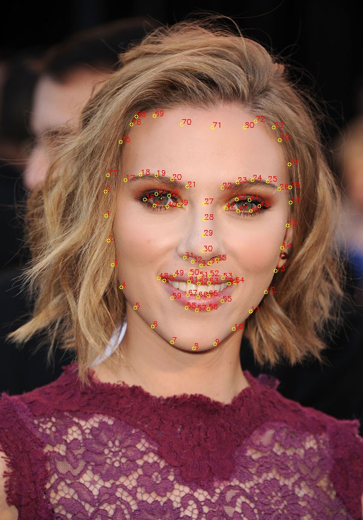

# M-SHAPE PROJECT 

### Objectives 
Detect Forehead baldness by calculating the ratio between vertical lines length on 
- central forehead  
- left forehead  
- right forehead  

### Hypothesis
If the ratio between central & left & right is imbalanced (and passed our defined threshold), we could classify that the user has forehead baldness

### Challenges
- Picture orientation (object is skewed to an axis,  not centered) 
![face cropped]
(bad_examples\6.jpg)

- Bad Contrast (can be overcomed by performing gamma correction) 

- Too Close 

- Over Exposed (on bangs) 

### Procedure

### Commands
for a list of images  
`python main.py` 
for single images
`python main.py --single=<PATH>`

# FNC (Receding Hairline) PROJECT

### Commands
`python main.py --m_shape=False`